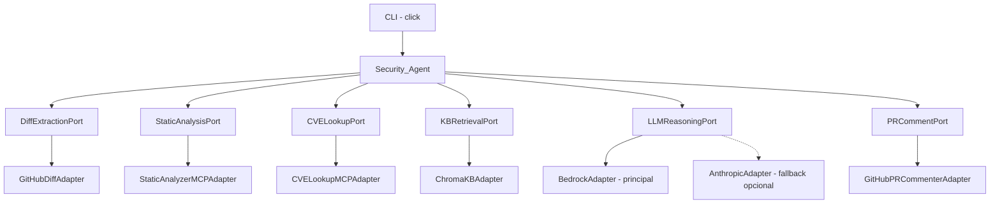
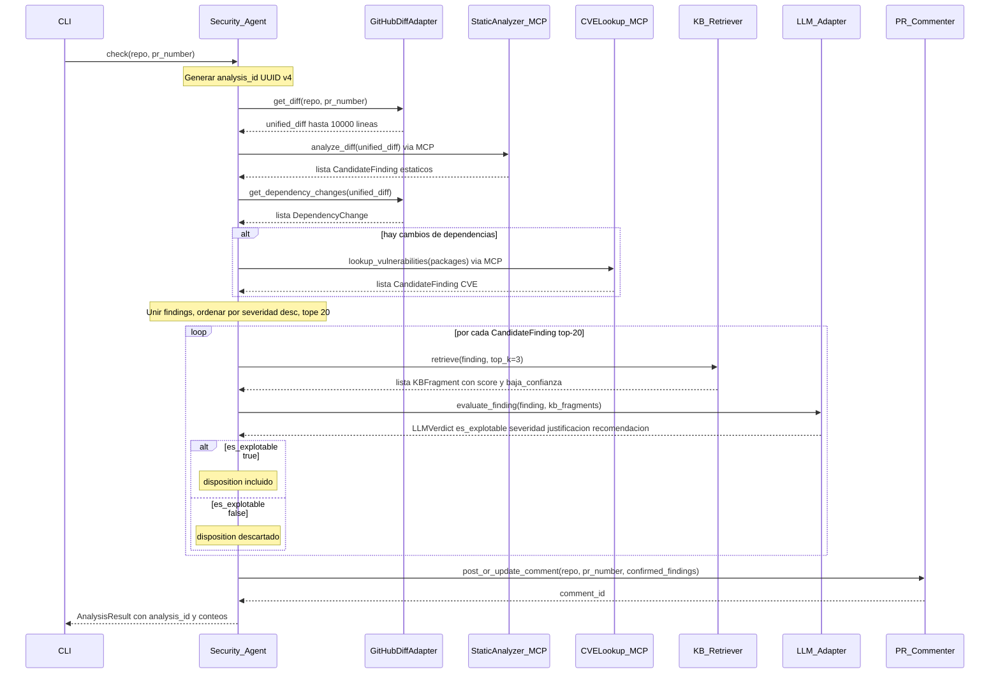

# Documento de Diseño — Security PR Guardian

> **Nota de versión**: La lógica de dominio es idéntica (extracción → SAST + CVE → razonamiento LLM con RAG → reporte), pero el punto de entrada cambió de un evento HTTP a un comando de terminal. El sistema ahora es una **herramienta CLI stateless** — sin proceso persistente, sin webhook escuchando.

## Overview

Security PR Guardian es una herramienta CLI stateless (y opcionalmente una GitHub Action delgada que la invoca) que analiza Pull Requests combinando: detección de patrones de código (SAST), escaneo de CVEs en dependencias, y razonamiento contextual de un LLM que filtra falsos positivos antes de reportar. Sin servidor persistente, sin webhook — solo `security-guardian check`, analiza un PR puntual, y termina.

El sistema está diseñado para distribución pública (`pip install security-pr-guardian`). Cada invocación de `security-guardian check` es una ejecución stateless y autocontenida.

### Objetivos de Diseño

1. **Precisión sobre cobertura total**: la capa LLM existe para filtrar falsos positivos. El valor está en el ruido que *no* se le muestra al desarrollador.
2. **Adopción sin fricción real**: `pip install` + credenciales. Amazon Bedrock es el backend LLM principal (obligatorio para producción / evaluadores AWS); Anthropic es el fallback para demos sin credenciales AWS.
3. **Extensible sin sobre-ingeniería**: arquitectura hexagonal (Ports & Adapters), pero solo UN adaptador por puerto en el MVP.
4. **Observable**: logs estructurados en JSON con un `analysis_id` propagado permiten rastrear cada decisión de extremo a extremo.
5. **Adaptable por equipo**: el archivo `.security-guardian.yml` opcional permite a cada equipo declarar sus convenciones de seguridad para que el LLM contextualice su veredicto en lugar de aplicar reglas genéricas.

---

## Backend del LLM — Bedrock como servicio AWS principal

**Amazon Bedrock es el backend PRINCIPAL y el servicio AWS que utiliza el sistema.** Satisface el requisito de usar al menos un servicio AWS. La autenticación es vía credenciales AWS IAM; dos variables de entorno lo controlan: `BEDROCK_REGION` y `BEDROCK_MODEL_ID`.

La API de Anthropic está disponible como **backend secundario opcional** para demos donde las credenciales AWS no están disponibles. Se activa configurando `llm_backend: anthropic` en `config.yaml`. El valor por defecto es `bedrock`.

```yaml
# config.yaml
llm_backend: bedrock   # "bedrock" (default, AWS) | "anthropic" (fallback demo)
```

Tanto `BedrockAdapter` como `AnthropicAdapter` implementan el mismo `LLMReasoningPort` — el resto del sistema no sabe ni le importa cuál está activo.

---

## Decisiones Tecnológicas

| Preocupación | Elección | Justificación |
|---|---|---|
| Lenguaje | Python 3.11+ | Ya establecido en el proyecto |
| LLM (principal, AWS) | Amazon Bedrock Converse API | Servicio AWS principal; interfaz unificada entre modelos; auth IAM |
| LLM (fallback opcional) | API de Anthropic (SDK `anthropic`) | Fallback para demos sin credenciales AWS |
| SDK MCP | `mcp` (SDK oficial Python, FastMCP) | Tools vía `@mcp.tool()`, transporte stdio |
| Vector store (KB) | ChromaDB + `sentence-transformers` | Embebido, sin servidor, sin dependencia AWS para KB en MVP |
| Cliente HTTP | `httpx` (async) | Async-first, reintentos, control de timeout |
| CLI | `click` + `rich` | Estándar, testeable, salida legible en terminal |
| Configuración | `pydantic-settings` | Merge env vars + `config.yaml`, validación tipada |
| Análisis estático | Reglas regex (`PatternEngine`) | Ver justificación abajo — se descarta AST por ahora |
| Testing | `pytest` + `moto` + `hypothesis` | Ya establecido en el steering del proyecto |

### Por qué regex y no AST/tree-sitter en el MVP

El diseño original mezclaba dos enfoques sin resolver: el módulo `ast` de Python (solo Python) y `tree-sitter` (multi-lenguaje, sobrecarga de configuración significativa). Para el MVP se elige un enfoque explícito: **reglas regex aplicadas directamente al texto del diff**, agnósticas del lenguaje. Es menos preciso que un AST real pero cubre los 7 CWE objetivo sin comprometerse a parsers por lenguaje que no se pueden construir bien en el tiempo del hackathon. La ruta de mejora AST/tree-sitter queda anotada como mejora futura en `tasks.md`.

---

## Architecture

Security PR Guardian sigue el patrón **Hexagonal (Ports & Adapters)**. El núcleo de dominio contiene toda la lógica de negocio y se comunica con el exterior exclusivamente a través de interfaces (puertos). Los adaptadores implementan esos puertos y son completamente reemplazables sin tocar el núcleo.



### Flujo de Análisis



---

## Components and Interfaces

### 1. Security_Agent (Orquestador de dominio)

Coordinador central en `security_pr_guardian/core/agent.py`. No contiene lógica de I/O — solo llama a puertos.

```python
class SecurityAgent:
    def __init__(
        self,
        diff_port: DiffExtractionPort,
        static_analysis_port: StaticAnalysisPort,
        cve_port: CVELookupPort,
        kb_port: KBRetrievalPort,
        llm_port: LLMReasoningPort,
        pr_comment_port: PRCommentPort,
        config: AppConfig,
        logger: StructuredLogger,
    ): ...

    async def run_analysis(self, repo: str, pr_number: int) -> AnalysisResult: ...
```

Responsabilidades:
- Genera `analysis_id` (UUID v4) y lo propaga a todos los componentes.
- Orquesta el pipeline de análisis en el orden correcto.
- Aplica el tope de 20 hallazgos (ordenados por severidad descendente antes de cortar).
- Maneja el flag `--no-comment` (dry-run).
- Emite eventos de log estructurado en cada etapa del pipeline.

### 2. Puertos (Interfaces)

Todos los puertos son clases base abstractas (ABCs) de Python en `security_pr_guardian/ports/`.

```python
# ports/diff_extraction.py
class DiffExtractionPort(ABC):
    @abstractmethod
    async def get_diff(self, repo: str, pr_number: int) -> str: ...
    @abstractmethod
    async def get_dependency_changes(self, diff: str) -> list[DependencyChange]: ...

# ports/static_analysis.py
class StaticAnalysisPort(ABC):
    @abstractmethod
    async def analyze_diff(self, diff: str) -> StaticAnalysisResult: ...

# ports/cve_lookup.py
class CVELookupPort(ABC):
    @abstractmethod
    async def lookup_vulnerabilities(
        self, packages: list[PackageRef]
    ) -> list[CVEFinding]: ...

# ports/kb_retrieval.py
class KBRetrievalPort(ABC):
    @abstractmethod
    async def retrieve(
        self, finding: CandidateFinding, top_k: int = 3
    ) -> list[KBFragment]: ...

# ports/llm_reasoning.py
class LLMReasoningPort(ABC):
    @abstractmethod
    async def evaluate_finding(
        self, finding: CandidateFinding, kb_context: list[KBFragment]
    ) -> LLMVerdict: ...

# ports/pr_comment.py
class PRCommentPort(ABC):
    @abstractmethod
    async def post_or_update_comment(
        self, repo: str, pr_number: int, findings: list[ConfirmedFinding]
    ) -> str: ...  # retorna comment_id
```

### 3. Servidor MCP Static_Analyzer

Ubicado en `security_pr_guardian/adapters/mcp/static_analyzer_server.py`. Corre como servidor FastMCP exponiendo una tool.

```python
mcp = FastMCP("static-analyzer")

@mcp.tool()
async def analyze_diff(diff: str) -> StaticAnalysisResult:
    """Analiza el diff unificado en busca de patrones de vulnerabilidad SAST."""
```

La detección la realiza un `PatternEngine` que aplica objetos `VulnerabilityRule`, uno por CWE. **Solo detección basada en regex — sin AST en el MVP.** Las reglas regex corren sobre las líneas añadidas (prefijo `+`) del diff unificado, agnósticas del lenguaje.

| CWE | Nombre | Estrategia de detección |
|---|---|---|
| CWE-89 | Inyección SQL | Formateo de strings en keywords SQL sin parametrizar |
| CWE-78 | Inyección de comandos OS | `os.system`, `subprocess` con `shell=True` e input variable |
| CWE-79 | XSS | Interpolación de variables sin escapar en respuestas HTML |
| CWE-502 | Deserialización insegura | `pickle.loads`, `yaml.load(` sin `Loader=`, `eval(` |
| CWE-798 | Credenciales hardcodeadas | Asignación a `password`/`secret`/`api_key`/`token` con literal de string |
| CWE-327 | Criptografía débil | `md5(`, `sha1(`, `DES.new(`, `hashlib.md5`, `hashlib.sha1` |
| CWE-552 | Referencia a rutas sensibles | Rutas absolutas con `/etc/passwd`, `/etc/shadow`, `~/.ssh/` |

`StaticAnalyzerMCPAdapter` (en `adapters/mcp/static_analyzer_adapter.py`) implementa `StaticAnalysisPort` llamando a este servidor vía el cliente SDK de `mcp`.

### 4. Servidor MCP CVE_Lookup

Ubicado en `security_pr_guardian/adapters/mcp/cve_lookup_server.py`. Expone una tool.

```python
@mcp.tool()
async def lookup_cve(
    package: str, version: str, ecosystem: str
) -> list[CVEFinding] | ErrorFinding:
    """Consulta OSV.dev por vulnerabilidades conocidas."""
```

Para procesamiento por lotes (hasta 50 paquetes), el adaptador usa `POST https://api.osv.dev/v1/querybatch` para minimizar round-trips. Lógica de reintentos: 2 intentos adicionales, espera fija de 3 segundos, luego retorna un finding de tipo `error_lookup`. `CVELookupMCPAdapter` implementa `CVELookupPort`.

### 5. KB_Retriever

**Solo una implementación concreta en el MVP: `ChromaKBAdapter`.**

`BedrockKBAdapter` queda documentado como extensión futura en `tasks.md` (activable vía `kb_backend: bedrock`), pero no se construye en el MVP.

**ChromaKBAdapter** (`adapters/kb/chroma_adapter.py`):
- Usa `chromadb` (embebido, persistente) + `sentence-transformers` (`all-MiniLM-L6-v2`).
- La base de conocimiento se distribuye junto al paquete en `security_pr_guardian/knowledge_base/`.
- Primera ejecución: embebe y persiste en `~/.security-guardian/kb/`.
- Query: similitud coseno sobre vectores de embedding, retorna top-3 con score.

Estructura del contenido de la base de conocimiento:

```
knowledge_base/
  owasp_top10_2025/    # 10 archivos markdown (A01-A10)
  cwes/                # CWE-89, 78, 79, 502, 798, 327, 552 — descripción + remediación
  historical_cases/    # 20+ markdown: snippet vulnerable + snippet corregido + refs CVE
```

### 6. Adaptador LLM

Dos implementaciones concretas de `LLMReasoningPort`. El adaptador activo se selecciona por `llm_backend` en `AppConfig`.

**BedrockAdapter** (`adapters/llm/bedrock_adapter.py`) — **PRINCIPAL (por defecto)**:
- Seleccionado cuando `llm_backend: bedrock` (el valor por defecto).
- Usa el cliente `boto3` `bedrock-runtime` con la **Converse API** (`client.converse()`).
- Autenticación vía credenciales AWS IAM (variables de entorno `BEDROCK_REGION` + `BEDROCK_MODEL_ID`).
- Reintentos: 3 intentos, backoff exponencial (5s, 10s, 20s). Se reintentan `ThrottlingException` y `ServiceUnavailableException`; no se reintenta `ValidationException`.

**AnthropicAdapter** (`adapters/llm/anthropic_adapter.py`) — **FALLBACK OPCIONAL**:
- Seleccionado cuando `llm_backend: anthropic`.
- Usa el SDK oficial `anthropic`. Requiere variable de entorno `ANTHROPIC_API_KEY`.
- Destinado a demos y desarrollo local donde las credenciales AWS no están disponibles.

Ambos adaptadores usan la misma estructura de prompt:

```
SYSTEM:
  Eres un experto en seguridad. Evalúa el siguiente hallazgo candidato de vulnerabilidad
  y determina si es realmente explotable en el contexto del código dado.
  Responde SOLO con JSON válido que coincida con el schema provisto.

USER:
  ## Hallazgo de Vulnerabilidad
  Tipo: {finding.tipo_vulnerabilidad}
  CWE: {finding.cwe_id}
  Archivo: {finding.archivo}:{finding.linea_inicio}
  Fragmento de código:
  {finding.fragmento_codigo}

  ## Contexto de la Base de Conocimiento
  {kb_context_formatted}

  ## Tarea
  Evalúa si este hallazgo es explotable en su contexto actual.
  Retorna JSON: {"es_explotable": bool, "severidad_ajustada": str,
                 "justificacion": str minimo 50 palabras,
                 "recomendacion": {"descripcion": str, "codigo_corregido": str, "referencia": str}}
```

### 7. PR_Commenter

`GitHubPRCommenterAdapter` (`adapters/github/pr_commenter.py`) implementa `PRCommentPort`.

- Usa `httpx.AsyncClient` con autenticación Bearer (`GITHUB_TOKEN`).
- Crear: `POST /repos/{owner}/{repo}/issues/{pr_number}/comments`
- Editar: `PATCH /repos/{owner}/{repo}/issues/comments/{comment_id}`
- Detecta comentario existente buscando la cadena de marca de agua `<!-- security-pr-guardian -->` en los comentarios del PR.
- Comentario renderizado vía Jinja2 (`templates/pr_comment.md.j2`).
- Reintentos: 3 intentos, backoff exponencial (2s, 4s, 8s) en errores 4xx/5xx.

### 8. CLI

`security_pr_guardian/cli/main.py` con `click` + `rich`.

```
security-guardian
  check   --repo <owner/repo> --pr <numero>
          [--output text|json]
          [--no-comment]
  init    [--profile]
          [--auto-detect]
```

El adaptador CLI resuelve `AppConfig`, instancia todos los adaptadores, los inyecta por constructor en `SecurityAgent`, y llama a `agent.run_analysis()`.

El subcomando `security-guardian init --profile` ejecuta un cuestionario interactivo usando `rich.prompt` y genera `.security-guardian.yml`. Con el flag `--auto-detect`, pre-rellena los campos escaneando el directorio de trabajo antes de mostrar las preguntas.

Códigos de salida:
- `0` — análisis completo, sin hallazgos explotables.
- `1` — análisis completo, al menos un hallazgo explotable.
- `2` — error de configuración, argumentos inválidos, o fallo de runtime irrecuperable.

---

## Data Models

Todos los modelos de dominio son clases `pydantic` `BaseModel` en `security_pr_guardian/core/models.py`.

```python
class Severity(str, Enum):
    CRITICAL = "critical"
    HIGH     = "high"
    MEDIUM   = "medium"
    LOW      = "low"
    INFO     = "info"

SEVERITY_ORDER = {Severity.CRITICAL: 5, Severity.HIGH: 4,
                  Severity.MEDIUM: 3, Severity.LOW: 2, Severity.INFO: 1}

class CandidateFinding(BaseModel):
    finding_id: str                  # UUID v4, generado en la creación
    source: Literal["static", "cve"]
    tipo_vulnerabilidad: str
    archivo: str
    linea_inicio: int
    linea_fin: int
    fragmento_codigo: str            # máx 500 caracteres
    patron_detectado: str
    cwe_id: str | None               # formato "CWE-<número>"
    cve_id: str | None
    paquete: str | None              # solo para findings CVE
    version: str | None
    ecosistema: str | None
    severidad_inicial: Severity

class Recommendation(BaseModel):
    descripcion: str
    codigo_corregido: str
    referencia: str

class LLMVerdict(BaseModel):
    es_explotable: bool
    severidad_ajustada: Severity
    justificacion: str               # mínimo 50 palabras, validado
    recomendacion: Recommendation

class ConfirmedFinding(BaseModel):
    finding_id: str
    source: Literal["static", "cve"]
    tipo_vulnerabilidad: str
    archivo: str
    linea_inicio: int
    linea_fin: int
    fragmento_codigo: str
    cwe_id: str | None
    cve_id: str | None
    severidad_ajustada: Severity
    justificacion: str
    recomendacion: Recommendation
    disposition: Literal["incluido", "descartado", "no_evaluado"]

class KBFragment(BaseModel):
    titulo: str
    contenido: str
    fuente: str
    score_relevancia: float          # 0.0–1.0
    baja_confianza: bool = False

class AnalysisResult(BaseModel):
    analysis_id: str                 # UUID v4
    repo: str
    pr_number: int
    candidate_count: int
    confirmed_count: int
    discarded_count: int
    not_evaluated_count: int
    confirmed_findings: list[ConfirmedFinding]
    diff_truncated: bool
    dependency_limit_exceeded: bool
    comment_id: str | None
    duration_seconds: float
    model_id: str
    guardian_version: str
    timestamp_utc: datetime

class AppConfig(BaseSettings):
    github_token: str
    llm_backend: Literal["bedrock", "anthropic"] = "bedrock"  # bedrock es el default
    bedrock_region: str | None = None      # requerido cuando llm_backend == "bedrock"
    bedrock_model_id: str | None = None    # requerido cuando llm_backend == "bedrock"
    anthropic_api_key: str | None = None   # requerido cuando llm_backend == "anthropic"
    osv_timeout_seconds: int = Field(default=10, ge=1, le=300)
    max_diff_lines: int = Field(default=10000, ge=1, le=10000)
    max_dependencies: int = Field(default=50, ge=1, le=1000)

    model_config = SettingsConfigDict(
        env_file=".env",
        yaml_file="config.yaml",
        env_prefix="",
        case_sensitive=False,
    )

class DependencyChange(BaseModel):
    manifest_file: str               # ej. "requirements.txt"
    package: str
    version: str
    ecosystem: str                   # "PyPI", "npm", "crates.io", etc.

class AllowedPattern(BaseModel):
    cwe_id: str                      # formato "CWE-<número>"
    razon: str                       # descripción del uso legítimo

class TeamProfile(BaseModel):
    frameworks: list[str] = []       # ej. ["django", "react", "fastapi"]
    auth_libraries: list[str] = []   # ej. ["bcrypt", "django-allauth"]
    allowed_patterns: list[AllowedPattern] = []  # patrones CWE permitidos con razón
    min_severity: Severity = Severity.LOW        # severidad mínima a reportar
    custom_exceptions: list[str] = []            # texto libre de convenciones del equipo

class LogEvent(BaseModel):
    timestamp: datetime              # ISO 8601 UTC
    analysis_id: str
    componente: str
    evento: str
    duracion_ms: int | None = None   # solo para operaciones con inicio y fin medibles
    detalle: dict[str, Any]
```

---

## Correctness Properties

*Una propiedad es una característica o comportamiento que debe mantenerse verdadero en todas las ejecuciones válidas del sistema. Las propiedades sirven como puente entre las especificaciones legibles por humanos y las garantías de corrección verificables por máquinas.*

### Property 1: Los hallazgos no explotables siempre se descartan

*Para cualquier* conjunto de hallazgos candidatos evaluados por el LLM, todo hallazgo donde `es_explotable` sea `false` debe tener `disposition: "descartado"` y no debe aparecer en `confirmed_findings`.

**Validates: Requirements 5.5**

---

### Property 2: analysis_id es un UUID v4 válido en todos los eventos de log

*Para cualquier* ejecución de análisis (independientemente del backend LLM activo — Bedrock principal o Anthropic fallback), cada evento de log estructurado emitido debe contener un campo `analysis_id` que coincida con el formato UUID v4.

**Validates: Requirements 9.1, 9.2**

---

### Property 3: confirmed_findings siempre ordenados por severidad descendente

*Para cualquier* lista de hallazgos confirmados producida por el pipeline, la lista publicada en el comentario del PR debe estar siempre ordenada `critical > high > medium > low > info` sin inversión de severidad entre elementos adyacentes.

**Validates: Requirements 7.1**

---

### Property 4: El número de hallazgos enviados al LLM nunca supera min(total_candidatos, 20)

*Para cualquier* conjunto de hallazgos candidatos de tamaño arbitrario, el número de hallazgos realmente pasados a `LLMReasoningPort.evaluate_finding` nunca debe superar `min(len(candidates), 20)`.

**Validates: Requirements 5.6**

---

### Property 5: Invariante de truncación de diff

*Para cualquier* diff unificado que supere 10.000 líneas, el `AnalysisResult` resultante debe tener `diff_truncated: true` y ningún `CandidateFinding.linea_inicio` debe referenciar una línea derivada de contenido más allá del límite de truncación.

**Validates: Requirements 2.6**

---

### Property 6: severidad_ajustada siempre es un valor válido del enum Severity

*Para cualquier* `ConfirmedFinding` producido tras la evaluación LLM, `severidad_ajustada` debe ser exactamente uno de: `critical`, `high`, `medium`, `low`, `info`.

**Validates: Requirements 5.4**

---

### Property 7: La recuperación KB retorna como máximo top_k fragmentos

*Para cualquier* invocación de `KBRetrievalPort.retrieve` con un `top_k` dado, el número de objetos `KBFragment` retornados debe satisfacer `0 ≤ len(result) ≤ top_k`.

**Validates: Requirements 6.2, 6.7**

---

### Property 8: Límite de dependencias aplicado — primeras 50 procesadas, limit_exceeded emitido

*Para cualquier* lista de cambios de dependencias con más de 50 entradas, el CVE lookup debe consultar exactamente las primeras 50 (por orden de aparición en el diff) y el resultado debe contener un finding de tipo `limit_exceeded`.

**Validates: Requirements 4.6**

---

### Property 9: La detección de manifiestos es exacta por nombre

*Para cualquier* ruta de archivo cuyo basename esté en el conjunto fijo `{package.json, requirements.txt, Pipfile, pyproject.toml, Cargo.toml, go.mod, pom.xml, build.gradle, ...}`, debe clasificarse como manifiesto de dependencias. *Para cualquier* ruta cuyo basename no esté en ese conjunto, no debe clasificarse como manifiesto.

**Validates: Requirements 2.2**

---

### Property 10: JSON inválido del LLM siempre produce no_evaluado

*Para cualquier* respuesta del LLM (Bedrock o Anthropic) que no sea JSON válido o le falte alguno de los campos requeridos, la disposición del finding resultante debe ser `no_evaluado`.

**Validates: Requirements 5.8**

---

### Property 11: score_relevancia siempre está dentro de [0.0, 1.0]

*Para cualquier* `KBFragment` retornado por `KBRetrievalPort`, el campo `score_relevancia` debe satisfacer `0.0 ≤ score_relevancia ≤ 1.0`.

**Validates: Requirements 6.3**

---

### Property 12: Los fragmentos de baja confianza siempre se marcan

*Para cualquier* resultado de recuperación KB donde todos los fragmentos tengan `score_relevancia < 0.5`, cada fragmento retornado debe tener `baja_confianza: true`.

**Validates: Requirements 6.4**

---

### Property 13: Timeout de KB retorna lista vacía, nunca resultados parciales

*Para cualquier* recuperación KB que no complete dentro de 5 segundos, la lista retornada debe estar vacía (longitud 0) — nunca se retorna una lista parcial de fragmentos.

**Validates: Requirements 6.6**

---

### Property 14: Los eventos de log siempre contienen los campos base requeridos

*Para cualquier* evento de log emitido por cualquier componente, el evento debe contener los campos `timestamp` (ISO 8601 UTC), `analysis_id`, `componente`, `evento` y `detalle`. El campo `duracion_ms` debe estar presente si y solo si el evento representa una operación completada con inicio y fin medibles.

**Validates: Requirements 9.2**

---

### Property 15: La salida JSON del CLI siempre es JSON parseable válido

*Para cualquier* resultado de análisis renderizado con `--output json`, los bytes escritos en stdout deben deserializarse a un objeto JSON válido que contenga como mínimo las claves `analysis_id`, `confirmed_count`, `discarded_count`, `confirmed_findings` y `diff_truncated`.

**Validates: Requirements 1.8**

### 9. TeamProfile — perfil de equipo

`security_pr_guardian/core/team_profile.py` contiene `TeamProfileLoader` y el modelo `TeamProfile`.

**TeamProfileLoader**:
- Busca `.security-guardian.yml` en el directorio de trabajo (`cwd`) al instanciarse.
- Si existe: parsea con `yaml.safe_load()`, valida con el modelo Pydantic `TeamProfile`, retorna la instancia.
- Si no existe o el YAML es inválido: retorna `TeamProfile()` (defaults vacíos) y emite un warning al logger.
- No lanza excepciones — degradación graciosa siempre.

**Integración en el prompt del LLM**: cuando `TeamProfile` tiene contenido, `BedrockAdapter` y `AnthropicAdapter` añaden una sección `## Perfil del Equipo` al prompt USER antes de `## Contexto de la Base de Conocimiento`:

```
## Perfil del Equipo
Frameworks: {frameworks}
Librerías de autenticación: {auth_libraries}
Patrones permitidos por convención del equipo:
{por cada allowed_pattern: "- CWE-{id}: {razon}"}
Excepciones adicionales:
{por cada custom_exception: "- {texto}"}
Severidad mínima de reporte: {min_severity}

Considera estas convenciones al evaluar si el hallazgo es realmente explotable
en el contexto de este equipo.
```

**`security-guardian init --profile`** — flujo interactivo:

```
Paso 1: Auto-detect (si --auto-detect)
  → Escanea requirements.txt, package.json, pyproject.toml, Cargo.toml
  → Detecta librerías de auth conocidas (bcrypt, passlib, argon2, django-allauth, etc.)
  → Infiere min_severity desde .bandit o ruff.toml si existen

Paso 2: Cuestionario (Rich prompts, valores detectados como defaults)
  → ¿Frameworks del proyecto? [django, react] ← pre-rellenado si --auto-detect
  → ¿Librerías de hashing/auth? [bcrypt] ←
  → ¿Usos legítimos de patrones marcados como vulnerables? (ej. "md5 para cache keys")
  → ¿Severidad mínima a reportar? [low]
  → ¿Convenciones adicionales del equipo?

Paso 3: Generar .security-guardian.yml
  → Confirmación antes de escribir si el archivo ya existe
```

---

## Error Handling

### Errores de la API de GitHub (extracción de diff y comentarios en PR)

Cuando cualquier llamada a la API REST de GitHub retorna 4xx/5xx o timeout:

- **Estrategia de reintentos**: Backoff exponencial base 2 segundos — esperas 2s, 4s, 8s; máximo 3 reintentos.
- **Fallo en extracción de diff**: Reintentos agotados → evento de log `analysis_failed`, código de salida 2.
- **Fallo en comentario del PR**: Reintentos agotados → evento de log `comment_publish_failed` con `analysis_id`, código HTTP y número de intentos. El resultado del análisis se retorna igual al CLI; un fallo de comentario no suprime la salida terminal.

### Errores de la API OSV.dev (CVE_Lookup)

Cuando `POST https://api.osv.dev/v1/query` o `/v1/querybatch` falla o supera `osv_timeout_seconds` (por defecto 10s):

- **Estrategia de reintentos**: 2 intentos adicionales, espera fija de 3 segundos entre cada uno.
- **Fallo definitivo**: Retorna `CVEFinding` de tipo `error_lookup` con `paquete`, `version`, `ecosistema`, `error_descripcion`. El análisis continúa con los demás findings.
- **Sin reintento para errores 4xx**: se tratan inmediatamente como `error_input`.

### Errores del LLM — Bedrock (principal) o Anthropic (fallback)

Cuando el backend LLM activo lanza throttling, indisponibilidad de servicio, o timeout de red:

- **Estrategia de reintentos**: Backoff exponencial base 5 segundos — esperas 5s, 10s, 20s; máximo 3 reintentos.
  - Bedrock: reintenta en `ThrottlingException`, `ServiceUnavailableException`; no en `ValidationException`.
  - Anthropic: reintenta en `RateLimitError`, `APIConnectionError`; no en `AuthenticationError`.
- **Fallo definitivo**: El `CandidateFinding` afectado se marca `disposition: "no_evaluado"` y se incluye en el comentario del PR con la etiqueta `⚠️ No evaluado — fallo de servicio LLM`.

### Respuesta JSON inválida del LLM

Cuando el LLM retorna una respuesta que no es JSON válido o le falta alguno de `es_explotable`, `severidad_ajustada`, `justificacion`, `recomendacion`:

- Finding marcado inmediatamente como `disposition: "no_evaluado"` con etiqueta `⚠️ No evaluado — fallo de parseo de respuesta LLM`.
- Sin reintentos para fallos de parseo.
- Registrado como `evento: "llm_parse_failure"` con respuesta raw (truncada a 1000 chars) en `detalle`.

### Timeout de recuperación KB (más de 5 segundos)

- Retorna `[]` inmediatamente; sin resultados parciales.
- `SecurityAgent` continúa la evaluación LLM con sección `## Contexto de la Base de Conocimiento` vacía.
- Emite evento de log `kb_timeout` con `finding_id` y tiempo transcurrido.

### Diff supera 10.000 líneas

- Solo las primeras `max_diff_lines` líneas se pasan a `Static_Analyzer` y `DependencyParser`.
- `AnalysisResult.diff_truncated` se establece en `true`.
- El comentario del PR incluye bloque de advertencia visible.
- Emite evento de log `diff_truncated` con el conteo original de líneas.

### Dependencias superan 50

- Solo las primeras 50 dependencias (en orden de aparición en el diff) se pasan a `CVE_Lookup`.
- Se emite un `CVEFinding` de tipo `limit_exceeded` indicando el conteo de dependencias omitidas.
- Se muestra como nota informativa en el comentario del PR.

### Validación de configuración al inicio

`AppConfig` valida credenciales al arrancar. Los fallos producen un mensaje descriptivo en `stderr` y código de salida 2:

- Si `llm_backend == "bedrock"`: `BEDROCK_REGION` y `BEDROCK_MODEL_ID` deben estar presentes.
- Si `llm_backend == "anthropic"`: `ANTHROPIC_API_KEY` debe estar presente.
- Si `GITHUB_TOKEN` está ausente: falla siempre independientemente del backend.

Ejemplo de salida de error:
```
Error: falta variable de entorno obligatoria: BEDROCK_REGION
(requerida cuando llm_backend = "bedrock")
```

No se inicia ningún análisis; no se hacen llamadas a la API de GitHub antes de que la validación de config complete exitosamente.

---

## Testing Strategy

### Resumen

Security PR Guardian usa una estrategia de testing de tres capas: **tests unitarios** para lógica de componentes aislados, **tests de integración** para el cableado de adaptadores contra servicios externos mockeados, y **tests basados en propiedades (PBT)** para invariantes de corrección universales. Las tres capas corren en CI en cada pull request.

### Frameworks

| Capa | Framework | Propósito |
|---|---|---|
| Unitario e integración | `pytest` + `pytest-asyncio` | Runner compatible con async |
| Basado en propiedades | `hypothesis` | PBT stateful y stateless |
| Mockeo HTTP | `pytest-httpx` | Mockear adaptadores `httpx` inline |
| Mockeo AWS | `moto` | Mockear llamadas boto3 (Bedrock vía `bedrock-runtime`) |
| Cobertura | `pytest-cov` | Reporte de cobertura de líneas |

### Fixtures de Tests

Diffs representativos reales para cada uno de los 7 CWE objetivo en `tests/fixtures/`:

```
tests/fixtures/
  cwe_89_sql_injection.diff
  cwe_78_os_command.diff
  cwe_79_xss.diff
  cwe_502_deserialization.diff
  cwe_798_hardcoded_creds.diff
  cwe_327_weak_crypto.diff
  cwe_552_sensitive_path.diff
  clean_pr.diff        # sin vulnerabilidades
  large_pr.diff        # mas de 10000 lineas para tests de truncación
```

Un test por criterio de aceptación: mínimo un test happy-path y un test negativo (input incorrecto o condición de error).

### Tests Unitarios

Cada adaptador y servicio de dominio se prueba en aislamiento con todo el I/O externo reemplazado por mocks.

Objetivos clave:
- **`DiffParser`** — detección de manifiestos, extracción de líneas `+`, truncación a 10.000 líneas.
- **`PatternEngine`** — cada regla CWE dispara en el snippet vulnerable conocido; sin falso positivo en el snippet limpio.
- **`BedrockAdapter`** — construcción correcta del prompt, reintento en `ThrottlingException` (mockeado vía `moto`), `no_evaluado` en fallo de parseo JSON.
- **`AnthropicAdapter`** — misma estructura de prompt que Bedrock; `no_evaluado` en JSON inválido; `RateLimitError` dispara reintento.
- **`GitHubPRCommenterAdapter`** — POST en primer comentario, PATCH en subsiguiente (marca de agua detectada), reintento en 5xx.
- **`CVELookupMCPAdapter`** — `error_lookup` tras reintentos agotados, `limit_exceeded` en el paquete 51.
- **`ChromaKBAdapter`** — `baja_confianza=True` cuando todos los scores son menores de 0.5, lista vacía en timeout.
- **CLI** — códigos de salida 0/1/2 para las condiciones correctas; `--output json` produce JSON parseable; `--no-comment` omite `PRCommentPort`.

### Tests de Integración

Tests de pipeline end-to-end usando diffs fixture y servicios externos completamente mockeados.

Escenarios clave:
- Happy path completo: diff con inyección SQL + una dependencia vulnerable → finding confirmado en comentario del PR.
- Análisis CVE omitido cuando no hay manifiestos de dependencias en el diff.
- Throttling de Bedrock: tras 3 reintentos, finding marcado `no_evaluado` con advertencia en comentario.
- Truncación de diff: diff con más de 10.000 líneas → `diff_truncated=True`, advertencia en comentario, sin finding más allá de la línea 10.000.
- Comentario PR existente: mock de GitHub retorna comentario con marca de agua → adaptador usa PATCH en lugar de POST.
- `llm_backend: anthropic`: pipeline completo con adaptador Anthropic activo (API mockeada).

### Tests de Contrato MCP

Schemas de tools MCP verificados contra formas de input/output esperadas usando `pytest` + `jsonschema`. Los tests llaman las funciones `@mcp.tool()` directamente en-proceso (sin overhead de transporte stdio):

- `analyze_diff`: input `{"diff": str}` → output coincide con schema JSON de `StaticAnalysisResult`.
- `lookup_cve`: input `{"package": str, "version": str, "ecosystem": str}` → output coincide con schema de lista `CVEFinding`.

### Tests Basados en Propiedades (Hypothesis)

Cada propiedad de la sección **Propiedades de Corrección** se implementa como un test Hypothesis con `@settings(max_examples=100)`.

| Propiedad | Estrategia Hypothesis |
|---|---|
| P1: No explotable → descartado | `st.lists(st.builds(CandidateFinding, ...), min_size=0, max_size=30)` |
| P2: analysis_id es UUID v4 en todos los logs | `st.builds(AppConfig, ...)` + ejecución de análisis mockeada |
| P3: confirmed_findings ordenados desc | `st.lists(st.builds(ConfirmedFinding, ...), min_size=0, max_size=25)` |
| P4: Llamadas LLM menor o igual a min(candidatos, 20) | `st.integers(min_value=0, max_value=100)` como conteo de candidatos |
| P5: Invariante de truncación de diff | `st.integers(min_value=9990, max_value=15000)` como conteo de líneas |
| P6: severidad_ajustada es enum válido | `st.builds(ConfirmedFinding, ...)` desde JSON LLM crudo |
| P7: KB retorna menor o igual a top_k fragmentos | `st.integers(min_value=1, max_value=10)` como `top_k` |
| P8: Límite de dependencias aplicado | `st.integers(min_value=51, max_value=200)` como conteo |
| P9: Detección de manifiesto exacta por nombre | `st.sampled_from(MANIFEST_NAMES)` unión `st.text()` |
| P10: JSON inválido → no_evaluado | `st.text()` unión `st.builds(dict, ...)` con campos aleatorios faltantes |
| P11: score_relevancia entre 0.0 y 1.0 | `st.builds(KBFragment, ...)` |
| P12: Fragmentos baja confianza marcados | `st.lists(st.floats(min_value=0.0, max_value=0.499))` |
| P13: Timeout → lista vacía | Timeout mockeado, cualquier input `CandidateFinding` |
| P14: Eventos de log tienen campos requeridos | `st.builds(LogEvent, ...)` con valores aleatorios |
| P15: --output json es JSON válido parseable | `st.builds(AnalysisResult, ...)` renderizado por el formateador CLI |

### Objetivo de Cobertura

- **Núcleo de dominio** (`security_pr_guardian/core/`): mayor o igual a 80% cobertura de líneas.
- **Adaptadores** (`security_pr_guardian/adapters/`): mayor o igual a 80% cobertura de líneas.
- **CLI** (`security_pr_guardian/cli/`): mayor o igual a 70% cobertura de líneas.

Aplicado vía `pytest --cov=security_pr_guardian --cov-fail-under=80` en CI. Las llamadas AWS siempre se mockean vía `moto` — ningún test corre contra infraestructura real.
